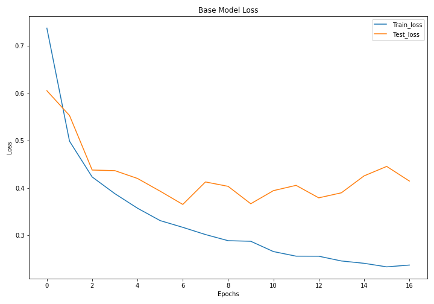

# Covid-CT-NN-Classification
Classifying and predicting covid with public imaging datasets 

Can we accurately classify an open-source set of ~20_000 CT scans across 4 labels? If so, can we classify more accurately than a radiologist? What can machine classification contribute to the field of radiology, and do open datasets enhance this exercise?

We approached this problem with an iterative nn modeling approach, beginning with a simple keras tf model, adding transfer learning, and finally including augmentations built into PyTorch. 

Data:

[COVID-19_Radiography_Dataset.zip][

Unzips to:  /COVID-19_Radiography_Dataset/{i}/masks
            /COVID-19_Radiography_Dataset/{i}/images
            
Where {i} = [normal, covid, lung_opacity, viral_pneumonia]. Masks are removed to prevent data leakage. 

Model performance:

Baseline models were limited to ~90% accuracy. Transfer learning yielded small gains, but augmentations (rotations, resizing, and normalization) yielded the strongest accuracy improvemnt (~7% vs. previous models). The most accurate model classified at ~97%, slightly below our SME threshold for specialist competency. 
