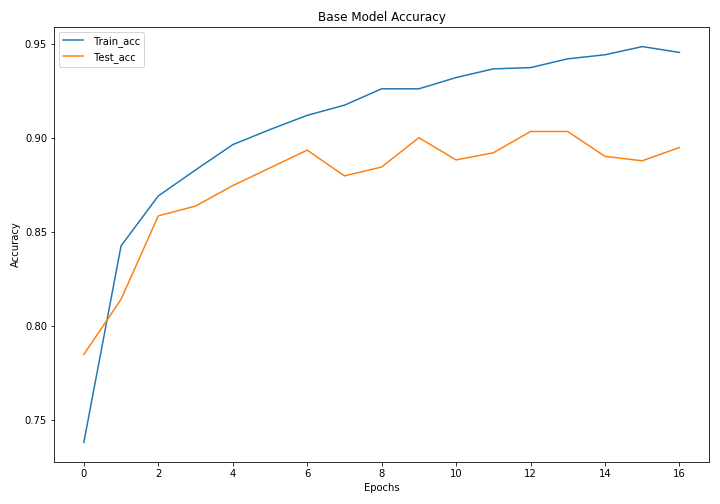
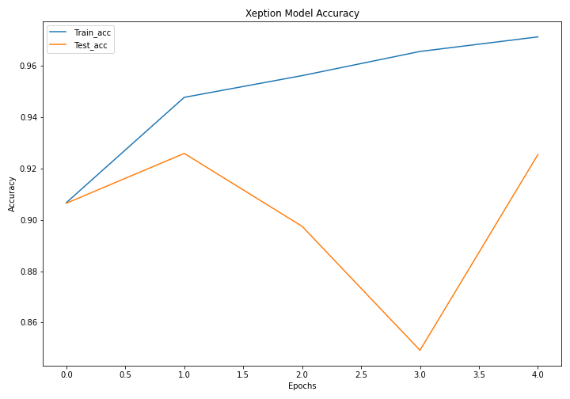
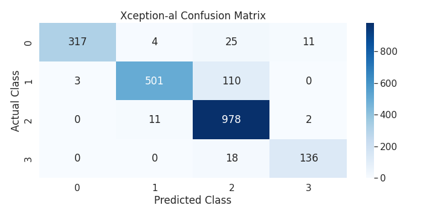
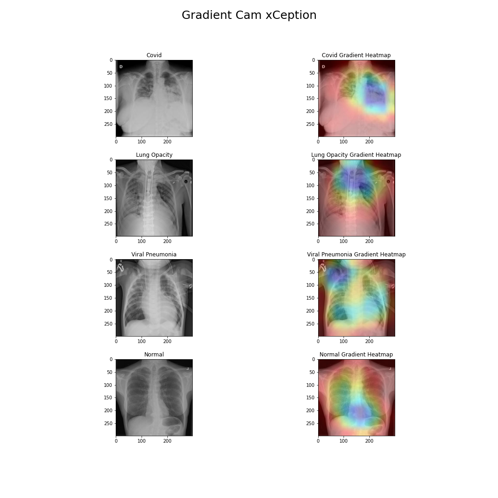

# Covid-CT-NN-Classification
## Problem
Classifying and predicting covid with public imaging datasets 

## Problem Statement
Can we accurately classify an open-source set of ~20_000 CT scans across 4 labels? If so, can we classify more accurately than a radiologist? What can machine classification contribute to the field of radiology, and do open datasets enhance this exercise?

## Executive Summary
We approached this problem with an iterative nn modeling approach, beginning with a simple keras tf model, adding transfer learning, and finally including augmentations built into PyTorch. 

## Data: 
Data taken from the covid 19 radiography database kaggle. https://www.kaggle.com/datasets/tawsifurrahman/covid19-radiography-database/code
[COVID-19_Radiography_Dataset.zip](https://www.kaggle.com/datasets/tawsifurrahman/covid19-radiography-database/code)

Unzips to:  /COVID-19_Radiography_Dataset/{i}/masks
            /COVID-19_Radiography_Dataset/{i}/images
            
Where {i} = [normal, covid, lung_opacity, viral_pneumonia]. Masks are removed to prevent data leakage. 

## Model performance:

Baseline models were limited to ~90% accuracy. Transfer learning yielded small gains, but augmentations (rotations, resizing, and normalization) yielded the strongest accuracy improvemnt (~7% vs. previous models). The most accurate model classified at ~97%, slightly below our SME threshold for specialist competency. 

. 

With the above confusion matrix we can see that we're getting the majority of our misclassifications in the normal images. This makes sense as a normal would be the most vague class to classify, as covid and pneumonia youre looking for a certain object within the images

One of the things we’ve implemented within our project to help with our understanding of our models was a technique called gradient camera.  Gradient cam  creates class activation maps that helps us visualize and interpret how our model looks at our data by taking the gradients of the last convolutional layer in the cnn and weighing them we can see how on each image our model is classifying them. 
